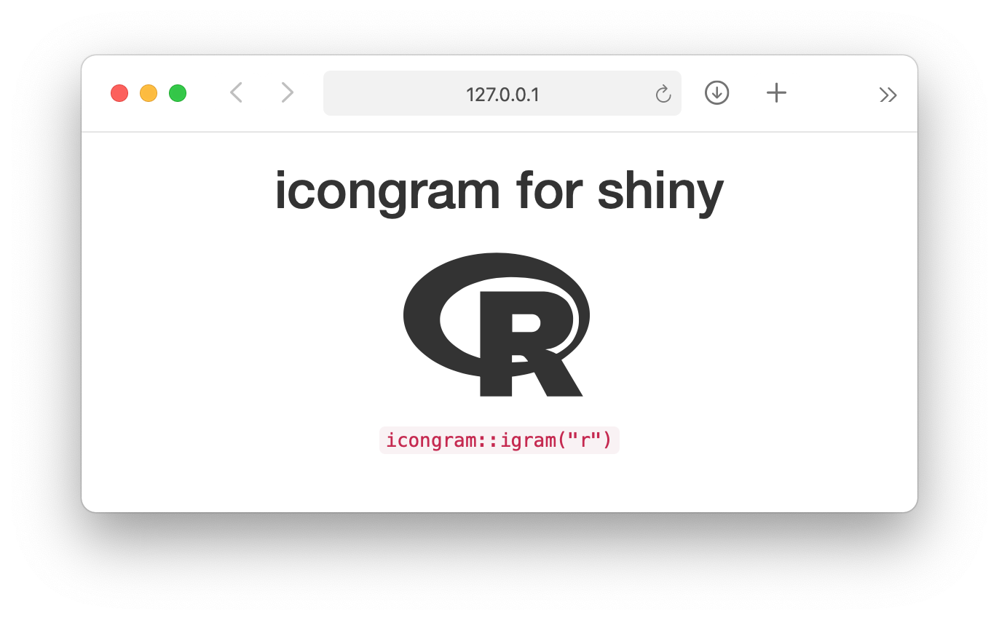

<!-- README.md is generated from README.Rmd. Please edit that file -->

icongram
========

<!-- badges: start -->

<!-- badges: end -->

10,107 icons for shiny development thanks to
[icongram](https://icongr.am).

Installation
------------

You can install the development version of icongram from GitHub with:

    # install.packages("devtools")
    devtools::install_github("r4fun/icongram")

Example
-------

Return an icon by calling `igram`:

    igram(
      icon = "r", 
      lib = "simple",
      size = 128, 
      color = "default" # alternatively, a hexcode
    )

Icon information is stored in `igrams`:

    igrams
    #> # A tibble: 10,107 x 3
    #>    lib     icon            url                                          
    #>    <chr>   <chr>           <chr>                                        
    #>  1 clarity accessibility-1 https://icongr.am/clarity/accessibility-1.svg
    #>  2 clarity accessibility-2 https://icongr.am/clarity/accessibility-2.svg
    #>  3 clarity add             https://icongr.am/clarity/add.svg            
    #>  4 clarity add-text        https://icongr.am/clarity/add-text.svg       
    #>  5 clarity administrator   https://icongr.am/clarity/administrator.svg  
    #>  6 clarity airplane        https://icongr.am/clarity/airplane.svg       
    #>  7 clarity alarm-clock     https://icongr.am/clarity/alarm-clock.svg    
    #>  8 clarity alarm-off       https://icongr.am/clarity/alarm-off.svg      
    #>  9 clarity alert           https://icongr.am/clarity/alert.svg          
    #> 10 clarity align-bottom    https://icongr.am/clarity/align-bottom.svg   
    #> # … with 10,097 more rows

A small shiny example:

    library(shiny)
    library(icongram)

    ui <- fluidPage(
      fluidRow(
        column(
          width = 12,
          align = "center",
          h1("icongram for shiny"),
          igram("r"),
          br(),
          tags$code('icongram::igram("r")')
        )
      )
    )

    server <- function(input, output, session) {
      
    }

    shinyApp(ui, server)

To view the raw HTML, use `raw = TRUE`:

    igram("r", raw = TRUE)

    #> <svg role="img" viewBox="0 0 24 24" xmlns="http://www.w3.org/2000/svg" width="128" height="128" fill="currentColor"><title>R icon</title><path d="M12 18.82c-6.627 0-12-3.598-12-8.037s5.373-8.037 12-8.037 12 3.599 12 8.037-5.373 8.037-12 8.037zm1.837-12.932c-5.038 0-9.121 2.46-9.121 5.495s4.083 5.494 9.12 5.494 8.756-1.682 8.756-5.494-3.718-5.495-8.755-5.495zM18.275 15.194a9.038 9.038 0 0 1 1.149.433 2.221 2.221 0 0 1 .582.416 1.573 1.573 0 0 1 .266.383l2.863 4.826-4.627.002-2.163-4.063a5.229 5.229 0 0 0-.716-.982.753.753 0 0 0-.549-.25h-1.099v5.292l-4.093.001V7.737h8.221s3.744.067 3.744 3.63a3.822 3.822 0 0 1-3.578 3.827zm-1.78-4.526l-2.479-.001v2.298h2.479a1.134 1.134 0 0 0 1.148-1.17 1.07 1.07 0 0 0-1.148-1.127z"/></svg>
